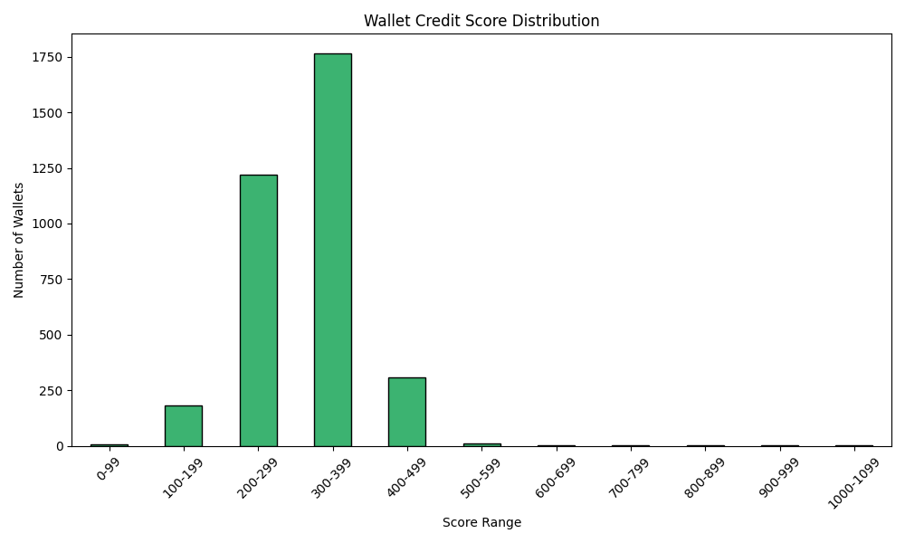

# Wallet Credit Score Analysis
Wallet Credit Score Analysis
🔹 Overview
The credit scores of DeFi wallets were computed based on transaction history, borrowing/repayment behavior, asset diversity, liquidation frequency, and stablecoin usage. The scores were normalized to a range of 0–1000.

🔹 Score Distribution
The following chart illustrates the number of wallets falling into different score ranges:

Score Ranges Used:
0–99, 100–199, 200–299, ..., 1000–1099
## Score Distribution

### Score Ranges and Wallet Counts
- **0-99**: 7 wallets
- **100-199**: 180 wallets
- **200-299**: 1220 wallets
- **300-399**: 1765 wallets
- **400-499**: 308 wallets
- **500-599**: 9 wallets
- **600-699**: 4 wallets
- **700-799**: 1 wallets
- **800-899**: 1 wallets
- **900-999**: 1 wallets
- **1000-1099**: 1 wallets

🔸 Behavioral Analysis
🔻 Wallets in the Lower Range (0–199)
Characteristics:

Low deposit or borrow activity

Minimal transaction frequency

Possibly dormant or one-off usage

High liquidation frequency in some cases

Limited asset diversity

Insights:

These wallets may belong to users testing the protocol or experiencing financial instability.

Low interaction with stablecoins or minimal creditworthy behavior.

🔺 Wallets in the Higher Range (400–1000)
Characteristics:

High number of transactions and consistent activity

High repayment-to-borrow ratio (good financial discipline)

Larger deposit volumes with low liquidation events

Greater diversity in asset usage

Heavy use of stablecoins

Insights:

These wallets represent reliable, long-term users who actively engage with the ecosystem.

High-value users with better risk profiles and greater on-chain activity.

## Conclusion
This scoring and analysis framework can help identify trustworthy users, flag risky wallets, and provide data for personalized DeFi services.
